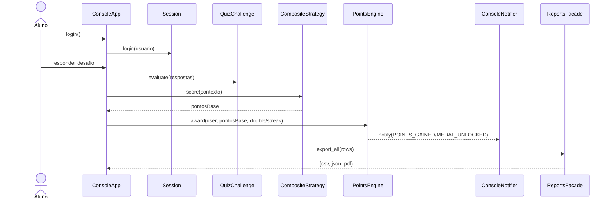

# Plataforma Colaborativa de Aprendizagem Gamificada (Console / Python)

Projeto acadêmico que aplica **padrões de projeto (GoF)** e princípios **SOLID** para compor
uma plataforma gamificada simples, executável via console.

> Requisitos atendidos (PDF do enunciado): gerenciamento de usuários (Singleton + Factory),
> desafios e pontuação (Strategy + Observer), gamificação (Decorator + Composite),
> relatórios (Facade) + integração externa (Adapter), histórico com *undo* (Command).
> Exportação: CSV, JSON e PDF (fallback caso `reportlab` não esteja instalado).

## Como executar
```bash
python -m venv .venv
source .venv/bin/activate  # Windows: .venv\Scripts\activate
pip install -U reportlab  # opcional, apenas para PDF real
python main.py
```

## Estrutura de pastas
```
app/
  core/ (Singleton, Factory Method)
  challenges/ (Challenge, Strategy, Observer)
  gamification/ (Decorator, Composite)
  history/ (Command com undo)
  reports/ (Facade, Adapter, Exporters)
  ui/ (Console)
  utils/ (Persistência simples)
```

## Padrões Aplicados (mín. 7, aqui 9)
- **Singleton**: controle global de sessão (`app/core/session.py`)
- **Factory Method**: criação de perfis/usuários (`app/core/users.py`)
- **Strategy**: estratégias de pontuação (dificuldade, acurácia, tempo) (`app/challenges/scoring.py`)
- **Observer**: notificação automática de eventos de gamificação (`app/challenges/observers.py` + `PointsEngine`)
- **Decorator**: *Double XP*, *StreakBonus* sobre a pontuação (`app/gamification/decorators.py`)
- **Composite**: hierarquia de medalhas/conquistas (`app/gamification/achievements.py`)
- **Adapter**: adaptação de ranking externo (`app/reports/adapters.py`)
- **Facade**: centralização de exportações e leaderboard (`app/reports/facade.py`)
- **Command**: histórico com *undo* (premiação de medalhas/pontos) (`app/history/commands.py`)

## Diagrama de Classes (Mermaid)

```mermaid
classDiagram
  class _SessionSingleton {
    +login(username, role)
    +logout()
    +is_authenticated()
  }
  class User {
    +username: str
    +role: str
    +points: int
    +level: int
    +medals: List[str]
    +add_points(int)
    +add_medal(str)
  }
  class UserFactory
  class AlunoFactory
  class ProfessorFactory
  class VisitanteFactory
  UserFactory <|.. AlunoFactory
  UserFactory <|.. ProfessorFactory
  UserFactory <|.. VisitanteFactory

  class Challenge
  class QuizChallenge
  Challenge <|.. QuizChallenge

  class ScoringStrategy
  class DifficultyStrategy
  class AccuracyStrategy
  class TimeStrategy
  class CompositeStrategy
  ScoringStrategy <|.. DifficultyStrategy
  ScoringStrategy <|.. AccuracyStrategy
  ScoringStrategy <|.. TimeStrategy
  ScoringStrategy <|.. CompositeStrategy

  class Subject
  class ConsoleNotifier
  Subject --> ConsoleNotifier

  class Score
  class BaseScore
  class ScoreDecorator
  class DoubleXP
  class StreakBonus
  Score <|.. BaseScore
  Score <|.. ScoreDecorator
  ScoreDecorator <|-- DoubleXP
  ScoreDecorator <|-- StreakBonus

  class AchievementComponent
  class Medal
  class MedalSet
  AchievementComponent <|.. Medal
  AchievementComponent <|.. MedalSet
  MedalSet o-- AchievementComponent

  class Command
  class AwardMedalCommand
  class AwardPointsCommand
  Command <|.. AwardMedalCommand
  Command <|.. AwardPointsCommand

  class ReportsFacade
  class CSVExporter
  class JSONExporter
  class PDFExporter
  class ExternalRankingAPI
  class RankingAdapter
  ReportsFacade --> CSVExporter
  ReportsFacade --> JSONExporter
  ReportsFacade --> PDFExporter
  ReportsFacade --> RankingAdapter
  RankingAdapter --> ExternalRankingAPI
```


## Diagrama de Sequência (Mermaid)


## Notas
- Exportação para PDF usa `reportlab` se disponível; caso contrário, gera
  um arquivo texto com extensão `.pdf` como *fallback*.
- Persistência simples em `data.json` (carregar/salvar).

## Licença
MIT

---

## GUI (Tkinter) — Opcional
Também é possível executar uma **interface simples (GUI)** sem alterar a lógica de domínio.

### Como executar a GUI
```bash
python main_gui.py
```

Recursos na GUI:
- Login e cadastro (Aluno/Professor/Visitante)
- Listagem de usuários (points/level/medals)
- Desafio (quiz) com Double XP e streak
- Leaderboard (Adapter)
- Conquistas (Composite)
- Exportação CSV/JSON/PDF (Facade)
- Audit Log (últimos eventos) e Undo (Command)
```
